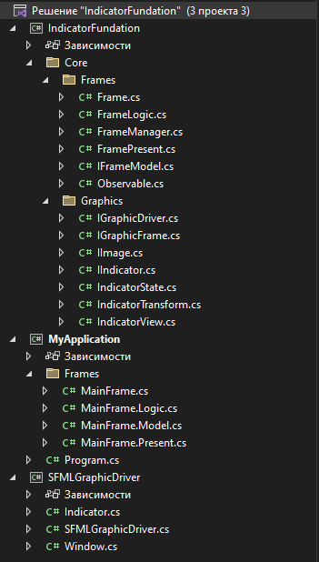
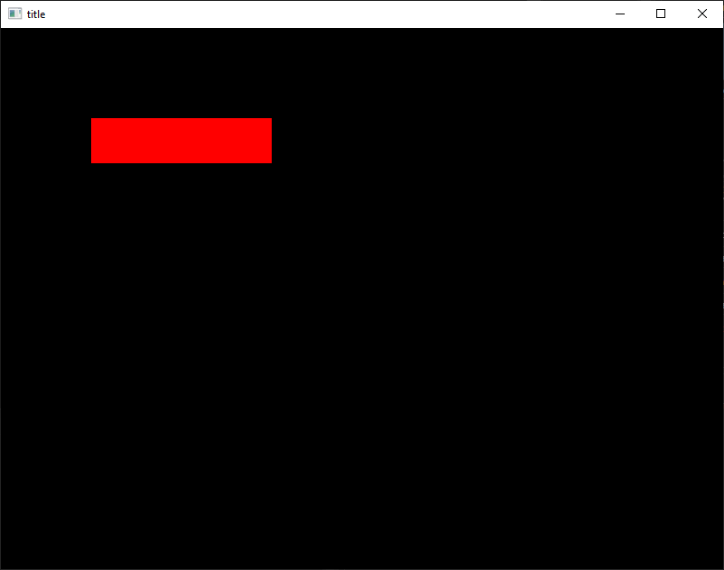

# IndicatorFundation



# Usage

Frame file

```cs
using IndicatorFundation.Core.Frames;
using IndicatorFundation.Core.Graphics;

namespace Frames.MainFrame;

public partial class MainFrame : Frame
{
    public MainFrame(IGraphicDriver graphicDriver, IGraphicFrame graphicFrame) 
        : base(graphicDriver, graphicFrame)
    {
        this.present = new Lazy<FramePresent>(() => new Present(this));
        this.logic = new Lazy<FrameLogic>(() => new Logic(this));
        this.model = new Lazy<IFrameModel>(() => new Model());
    }


    public partial class Present : FramePresent
    {
        new Model model => (Model)base.model;

        public override void Dispose()
        {
            this.Deinit();
            base.Dispose();
        }
    }
}
```

Present file

```cs
using IndicatorFundation.Core.Frames;
using IndicatorFundation.Core.Graphics;

namespace Frames.MainFrame;

public partial class MainFrame
{
    /// <summary>
    /// Auto generated
    /// </summary>
    public partial class Present : FramePresent
    {
        #region Indicators

        readonly IIndicator SpeedIsZero;

        #endregion

        #region Methods

        public Present(Frame frame) : base(frame)
        {
            this.SpeedIsZero = this.frame.graphicFrame.CreateIndicator(new IndicatorTransform()
            {
                positionX = 100,
                positionY = 100,
                sizeX = 200,
                sizeY = 50,
            }, IndicatorView.backColor);
            this.SpeedIsZero.state = this.SpeedIsZero_Red;

            this.model.name_Changed += this.name_Changed;
        }

        private void Deinit()
        {
            this.model.name_Changed -= this.name_Changed;
        }

        #endregion

        #region States

        #region SpeedIsZero

        IndicatorState SpeedIsZero_Green = new IndicatorState()
        {
            BackColor = 0x00FF00FFu,
        };

        IndicatorState SpeedIsZero_Red = new IndicatorState()
        {
            BackColor = 0xFF0000FFu,
        };

        #endregion

        #endregion

        #region Model handles
        
        private void name_Changed(bool obj)
        {
            this.SpeedIsZero_Changed();
        }

        #endregion

        #region Indicator handlers

        void SpeedIsZero_Changed()
        {
            if (this.model.name)
            {
                this.SpeedIsZero.state = this.SpeedIsZero_Green;
            }
            else
            {
                this.SpeedIsZero.state = this.SpeedIsZero_Red;
            }
        }

        #endregion
    }
}
```

Logic file
```cs
using System.Collections;
using IndicatorFundation.Core.Frames;

namespace Frames.MainFrame;

public partial class MainFrame
{
    /// <summary>
    /// Will never generate code
    /// </summary>
    public class Logic : FrameLogic
    {
        Model model => (Model)this.frame.model.Value;
        public Logic(Frame frame) : base(frame)
        {
            base.Start(this.Cycle());
        }

        public IEnumerator Cycle()
        {
            while (this.frame.Visible)
            {
                this.model.name = !this.model.name;
                yield return new WaitTime(1000);
            }
            yield break;
        }
    }
}
```

Model

```cs
using IndicatorFundation.Core.Frames;

namespace Frames.MainFrame;

public partial class MainFrame
{
    /// <summary>
    /// Auto generated
    /// </summary>
    public class Model : IFrameModel
    {
        private bool _name;
        public bool name 
        { 
            get => this._name; 
            set 
            {
                this._name = value;
                this.name_Changed?.Invoke(this._name);
            } 
        }
        public event Action<bool>? name_Changed;
    }
}
```